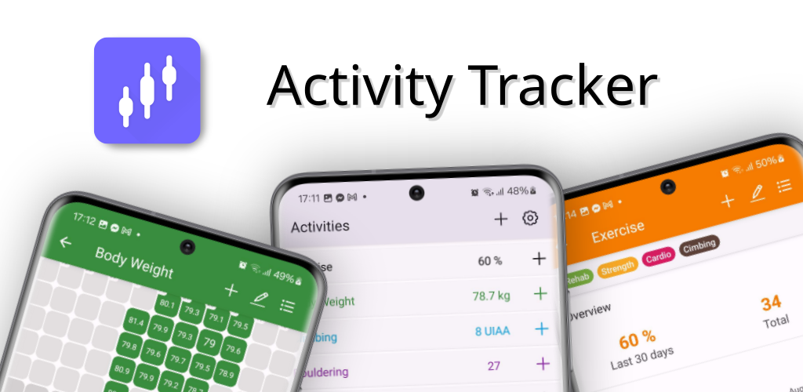

[](google-play/feature-graphic.png)

# Activity Tracker

<!-- This description is formatted with HTML to be copy-pasteable into Google Play description -->

Track your performance metrics and their progress over time. With custom statistics, charts and graphs, you can track anything, from body weight to Bowling scores. The app is ad-free, open-source, and gives you complete ownership of your data.

<b>Simplicity</b>: Minimalistic interface focused on quick data entry and easy analysis. No notifications, no ads, no distractions. Just data.

<b>Flexibility</b>: Tag your data points, add notes, use any measurement units, generate custom statistics and graphs. Everything can be tracked in one app. You can track your daily, monthly or yearly progress.

<b>Data Visualization</b>: Analyze your progress with interactive charts, calendars, box plots, line graphs, and histograms.

<b>Data Ownership</b>: Your data is stored locally on your device. You can export or back up your data into simple JSON or CSV files. You can open these files with your favourite spreadsheet editor or data analysis tools.

## Links

- [Privacy Policy](https://potocpav.github.io/activity-tracker/privacy)

## Screenshots


[](screenshots/sshot-1.jpg)
[](screenshots/sshot-2.jpg)
[](screenshots/sshot-3.jpg)
[](screenshots/sshot-4.jpg)
[](screenshots/sshot-5.jpg)
[](screenshots/sshot-6.jpg)

## Changelog

### 2.0 (Planned)

- [x] Multiple calendars and graphs per activity
- [x] Improved units (time units, climbing grades, etc.)
- [ ] Reimplement graphs to use FlatList instead of VictoryNative
- [ ] Bluetooth integration with Tindeq Progressor and other scales
- [ ] JSON import validation
- [ ] Tag groups

### 1.0

- Activity management
- Data point management
- Tags, filtering
- Summary values, calendars and graphs
- Settings
- Data import and export

## Bugfixes and improvements

- [ ] Polish unit management
  - [x] Basic styling and usability
  - [ ] Use React navigation for the Unit selection dialog
  - [ ] Add more units (distance)
  - [ ] Climbing grade input
  - [ ] New climbing grades (French, Font)
  - [ ] Automatic unit conversions
- [ ] Animations for adding and removing calendars and graphs

## Development

Prerequisites:

- Expo CLI

Running the App:

```bash
npx expo start --tunnel
```
