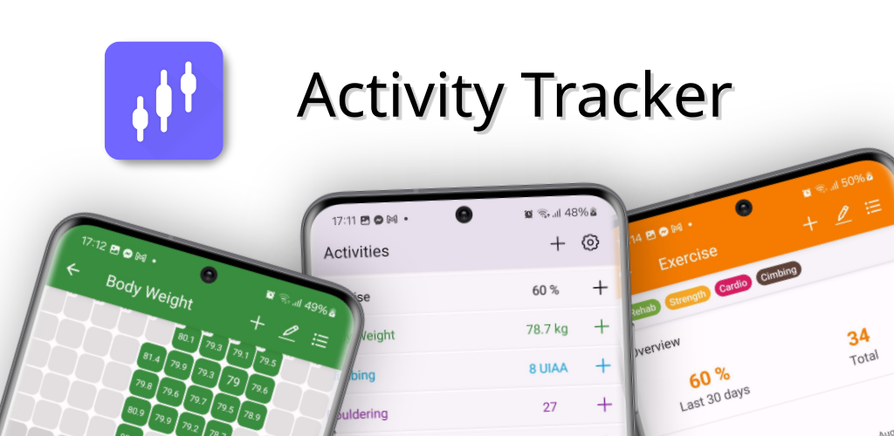
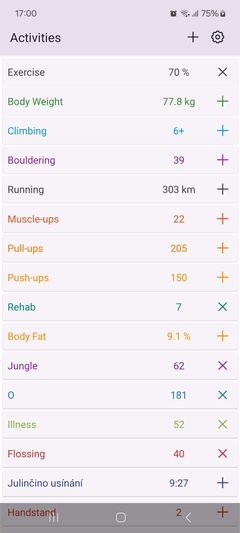
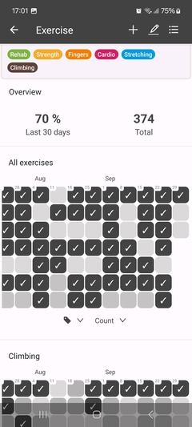
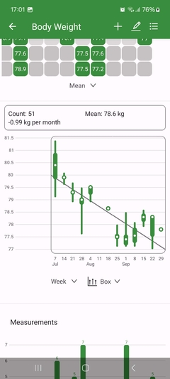
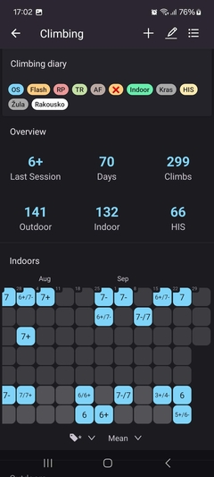
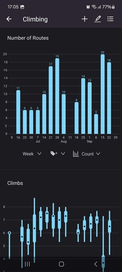
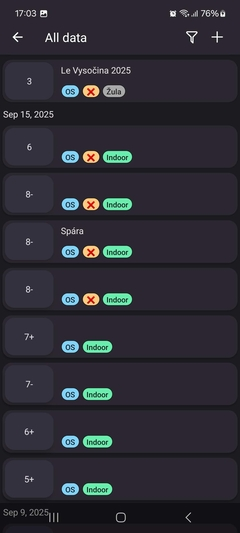

[](google-play/feature-graphic.png)

<h1 align="center">Activity Tracker</h1>

<!-- 
<p align="center">
<a href="https://play.google.com/store/apps/details?id=com.pavelpotocek.activitytracker"></a>
</p>
-->

> This app is currently in the internal testing phase on [Google Play](https://play.google.com/store/apps/details?id=com.pavelpotocek.activitytracker). To request an invitation to  download & test it, contact me at pavel.potocek@gmail.com. Alternatively, download an APK release from the [releases page](https://github.com/potocpav/activity-tracker/releases).


<!-- This description is formatted with HTML to be copy-pasteable into Google Play description -->

Track your performance metrics and their progress over time. With custom statistics, charts and graphs, you can track anything, from body weight to Bowling scores. The app is ad-free, open-source, and gives you complete ownership of your data.

<b>Simplicity</b>: Minimalistic interface focused on quick data entry and easy analysis. No notifications, no ads, no distractions. Just data.

<b>Flexibility</b>: Tag your data points, add notes, use any measurement units, generate custom statistics and graphs. Everything can be tracked in one app. You can track your daily, monthly or yearly progress.

<b>Data Visualization</b>: Analyze your progress with interactive charts, calendars, box plots, line graphs, and histograms.

<b>Data Ownership</b>: Your data is stored locally on your device. You can export or back up your data into simple JSON or CSV files. You can open these files with your favourite spreadsheet editor or data analysis tools.

## Links

- [FAQ](https://potocpav.github.io/activity-tracker/faq)
- [Change Log](CHANGELOG.md)
- [Privacy Policy](https://potocpav.github.io/activity-tracker/privacy)
- [APK Downloads](https://github.com/potocpav/activity-tracker/releases)
- [Google Play](https://play.google.com/store/apps/details?id=com.pavelpotocek.activitytracker)

## Screenshots

[](screenshots/sshot-1.jpg)
[](screenshots/sshot-2.jpg)
[](screenshots/sshot-3.jpg)
[](screenshots/sshot-4.jpg)
[](screenshots/sshot-5.jpg)
[](screenshots/sshot-6.jpg)

## Tindeq Progressor

Activity Tracker can record data from Tindeq Progressor. See the [FAQ for a quick guide](https://potocpav.github.io/activity-tracker/faq#q2). 

**Features:**

- **Automatic pull detection** instead of following a strict workout schedule. You can pull whenever you want.
- Average force and time-under-tension calculation
- Track multiple grips, edges and workout plans with Activities and Tags
- Track your progress over time with graphs, statistics and tagging
- Smooth graph scrolling 😀

**Non-features:**

- Workout plans or schedules
- Critical force calculation
- Bulk data point editing
- Bluetooth connection is a bit unreliable

## Development

Prerequisites:

- Expo CLI
- EAS CLI

This app can not be run in Expo Go. To run the app, compile a development APK with EAS:

```bash
eas build --platform android --profile development --local
```

Install the APK on your device with ADB. Then, run the Expo app and scan the QR code on your device:

```bash
npx expo
```

### Preview build

Development build is not suitable for daily use. You can compile a preview build with EAS to use the app:

```bash
eas build --platform android --profile preview --local
```

Install the APK on your device, and use the app normally.

### Data sharing

You can transfer data among different app builds with the import & export feature. Data should never be imported from a newer app version into an older one - that way, data migrations would not work.
