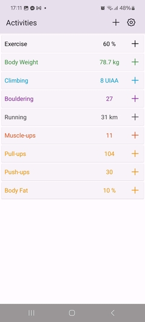
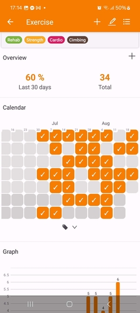
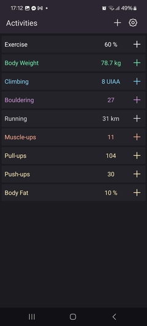

# Activity Tracker

**This app is work-in-progress, and I don't know how far I'll get before I get bored of it. It is now useful to me, and I use it every day. But YMMV (-:**

This app enables you to track your workouts, habits, body measurments, or other values.


## Features

- **Multiple Activities Tracking**: Track any type of activity data with customizable units and values
- **Flexible Data Visualization**: Analyze your progress with interactive charts, including box plots, line graphs, and histograms
- **Simple and Intuitive**: Clean interface focused on quick data entry and easy analysis
- **Smart Organization**: Tag your activities and filter data to focus on what matters to you

## ToDo List

In order to make this app a full-featured management app for activity data, the following list of features must be implemented:
  
### Features
  
* [ ] Dragging points in Day View

### General Usability

* [ ] Fix dark theme in Data section
* [ ] Fix multi-value display in Data section
* [ ] Decrease brightness of edit field borders
* [ ] Performance testing & enhancements
  * [ ] Many points (10k)
  * [ ] Wide date ranges (25 years)

### Publication

* [x] Rebrand to "Activities" / "Activity Tracker"
* [ ] Add screenshots
* [ ] Make app store description
* [ ] Improve GitHub README
* [ ] Link to GitHub from Settings
* [ ] Rename GitHub project

### Post-release

* [ ] Limit graph Panning on the left

### Tindeq analysis

* [x] Disable Tindeq for now
* [ ] Auto-analyze and add reps from Tindeq
* [ ] Integrate Tindeq with activity management
* [ ] Improve connection so that we never get stuck
* [ ] Tare with automatic disconnect/connect

## Screenshots

[](screenshots/sshot-1.jpg)
[](screenshots/sshot-2.jpg)
[](screenshots/sshot-3.jpg)
[](screenshots/sshot-4.jpg)
[](screenshots/sshot-5.jpg)
[](screenshots/sshot-6.jpg)


## Prerequisites

- Expo CLI
- Optional: Tindeq Progressor device

## Running the App

1. **Start the development server**
   ```bash
   npx expo start --tunnel
   ```

2. **Connect your device**
   - Scan the QR code with Expo Go (Android)
   - Scan the QR code with Camera app (iOS)

3. **Grant permissions**
   - Allow Bluetooth permissions when prompted
   - Allow location permissions (required for BLE scanning)

## Usage

### Connecting to a Device

1. **Open the app** and navigate to the main screen
2. **Tap "Connect"** in the status bar
3. **Ensure your Tindeq Progressor** has a blinking green light
   - If not blinking, press the button on the device
4. **Select your device** from the list of available Progressor devices
5. **Wait for connection** - the status indicator will turn green when connected

### Taking Measurements

1. **Navigate to "Live View"** from the main screen
2. **Tare the scale** (optional) by pressing the "Tare" button
3. **Start measurement** by pressing the "Start" button
4. **Perform your exercise** - the app will display real-time data
5. **Stop measurement** by pressing the "Stop" button

## Technical Details

### Architecture

- **State Management**: Zustand for global state
- **Bluetooth**: react-native-ble-plx for BLE communication
- **Charts**: Victory Native for data visualization
- **UI Framework**: React Native with custom styling

## License

This project is licensed under the MIT License
