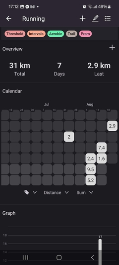

# Activity Tracker

This app enables you to track your workouts, habits, body measurments, or other values.

## Features

- **Simplicity**: Clean interface focused on quick data entry and easy analysis
- **Flexibility**: Tag your data points, track multiple values per day, use any measurement units, compute custom graphs and statistics
- **Data Visualization**: Analyze your progress with interactive charts, including box plots, line graphs, and histograms
- **Data Ownership**: You can back up your data into JSON or CSV files

## Screenshots

[](screenshots/sshot-1.jpg)
[](screenshots/sshot-2.jpg)
[](screenshots/sshot-3.jpg)
[](screenshots/sshot-4.jpg)
[](screenshots/sshot-5.jpg)
[](screenshots/sshot-6.jpg)

## Changelog

### 2.0 (Planned)

- [x] Multiple calendars and graphs per activity
  - [ ] Animations for adding and removing calendars and graphs
- [x] Improved units (time units, climbing grades, etc.)
  - [ ] Polish UI
  - [ ] Add more units
- [ ] Reimplement graphs to use FlatList instead of VictoryNative
- [ ] Bluetooth integration with Tindeq Progressor and other scales
- [ ] JSON import validation
- [ ] Tag groups

### 1.0

- [x] Activity management
- [x] Data point management
- [x] Tags, filtering
- [x] Summary values, calendars and graphs
- [x] Settings
- [x] Data import and export

## Development

Prerequisites:

- Expo CLI

Running the App:

```bash
npx expo start --tunnel
```
